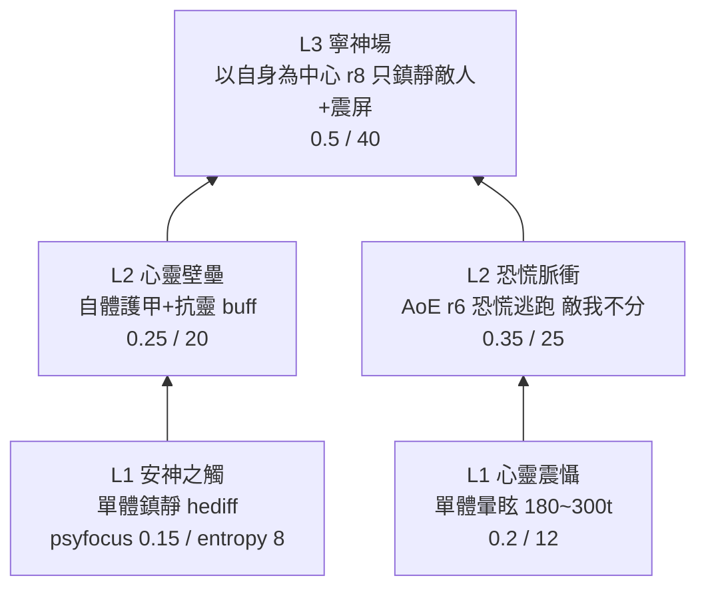

# vpe-example-path — VPE 新道路示範：寧神者（Tranquilizer）

## 目標
證明「在 Vanilla Psycasts Expanded 下新增一條完整靈能道路＝**全純 XML、零 patch、零 C#**」。
配套分析（含全部源碼佐證 file:line）：`~/repo/analysis/rimworld_mods/vanilla-psycasts-expanded/`（主報告 `tutorial/01_define_new_path.md`）。

## 範圍
- 1 條 `VanillaPsycastsExpanded.PsycasterPathDef`（`PASVPE_Tranquilizer`，主頁籤 Psycasts，無解鎖限制）。
- 5 個 `VEF.Abilities.AbilityDef`（3 層樹，每層 ≤3 格的 UI 硬限制內）。
- 2 個自訂 `HediffDef`（帶 `HediffCompProperties_Disappears` 讓 `durationTime` 生效）。
- 繁中／簡中 DefInjected（資料夾名用完整型別名 `VEF.Abilities.AbilityDef` 等，照官方漢化包慣例；簡中由 opencc t2s 轉出）。

## 能力樹設計

注意：`prerequisites` 是 **OR** 語意（任一已學即可），寧神場列兩個前置＝「學過任一 L2 即可解鎖」。

## 用到的純 XML 積木
`AbilityExtension_Psycast`（VPE 靈能身分）、`AbilityExtension_Hediff`（含 `applyToCaster` / `targetOnlyEnemies` 兩種用法）、`AbilityExtension_Stun`、`AbilityExtension_GiveMentalState`（vanilla `PanicFlee`）、`AbilityExtension_ScreenShaker`、`hasAoE`+`targetingParametersForAoE`。

## 技術棧 / 相依
RimWorld 1.6＋Royalty；Harmony、VEF（`OskarPotocki.VanillaFactionsExpanded.Core`）、VPE（`VanillaExpanded.VPsycastsE`）。零 Assembly。
**1.6 陷阱**：VEF 命名空間是 `VEF.Abilities`（1.5 以前的 `VFECore.Abilities` 會炸）。

## 佔位資產（待補）
| 資產 | 現況 | 正式規格 |
|---|---|---|
| 道路背景 `background` | 未提供——用 def 內 `width=190/height=303/backgroundColor` 純色 fallback（VPE `PostLoad` 自動生成） | PNG **950×1515** RGBA → `Textures/UI/Backgrounds/TranquilizerPath.png`，補檔後在 path def 加 `<background>UI/Backgrounds/TranquilizerPath</background>` 並刪三個 fallback 欄位；可另補 `altBackground`（950×1515）進 `Textures/UI/AlternativeBackgrounds/` |
| 能力圖示 ×5 | 借 Royalty 內建圖示佔位（`UI/Abilities/Painblock`、`Stun`、`EntropyLink`、`Burden`、`BlindingPulse`；在 AssetBundle 內，ContentFinder 同名可撈） | PNG **64×64** RGBA ×5 → `Textures/UI/Abilities/PASVPE_*.png`，改各 def 的 `iconPath` |

## 完成定義
- [x] XML 全部 well-formed（`tests/healthcheck.py`）。
- [x] defName / 前置引用 / path 引用交叉一致（healthcheck 驗證）。
- [ ] 實機：mod 載入零紅字；ITab 出現寧神者卡片；純色 fallback 背景顯示正常。
- [ ] 實機：dev mode 解鎖道路與 5 能力，逐一施法驗證效果（鎮靜 capMods、暈眩、自體 buff、AoE 恐慌、寧神場只打敵人）。
- [ ] 實機：psytrainer 自動生成（物品 `Psytrainer_PASVPE_*` 應出現在 debug 生成清單）。

## 部署（未執行——本任務不部署）
`~/rimworld_mods/vpe-example-path` → symlink 進遊戲 `install/Mods/`（見 MEMORY 慣例）。
